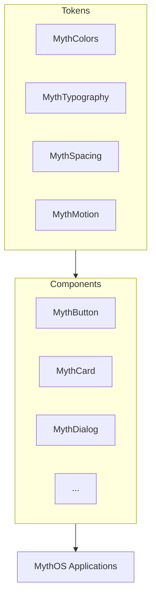

# MythUI

The official UI component library for MythOS.

MythUI provides the visual foundation for all MythOS applications — a consistent, premium, futuristic design system following the **Minimal Cyberpunk** design language.

## Design System

MythUI is built on a layered architecture:

### Token Layer
Design tokens that define the visual language:
- **MythColors** — Complete color palette (Void Black, Myth Cyan, Myth Purple, semantic colors)
- **MythTypography** — Type scale using Inter (UI) and JetBrains Mono (code)
- **MythSpacing** — Spacing, radius, and shadow definitions
- **MythMotion** — Animation durations and easing curves

### Component Layer
Reusable UI components:

| Component | Description |
|-----------|-------------|
| MythButton | Multi-variant button (primary, secondary, ghost, danger) |
| MythCard | Glass-effect information container |
| MythWindow | Custom title bar application wrapper |
| MythDialog | Modal dialog with backdrop overlay |
| MythNotification | Toast notifications (info, success, warning, error) |
| MythTextField | Styled text input with focus glow |
| MythToggle | Animated toggle switch |
| MythSlider | Horizontal slider with thumb glow |
| MythProgressBar | Determinate and indeterminate progress |
| MythToolTip | Floating tooltip |

## Requirements

- Qt 6.5+
- CMake 3.22+
- C++20 compiler

## Building & Running

```bash
mkdir build
cd build
cmake ..
cmake --build .

# Run the component showcase demo:
./examples/MythUIDemoApp
```

## Usage

In your CMakeLists.txt:
```cmake
target_link_libraries(YourApp PRIVATE MythUI)
```

In your QML:
```qml
import QtQuick 6.0
import MythUI

MythButton {
    text: "Initialize"
    type: "primary"
    onClicked: console.log("Initialized")
}
```

## Architecture



## License

Apache License 2.0 — See LICENSE
